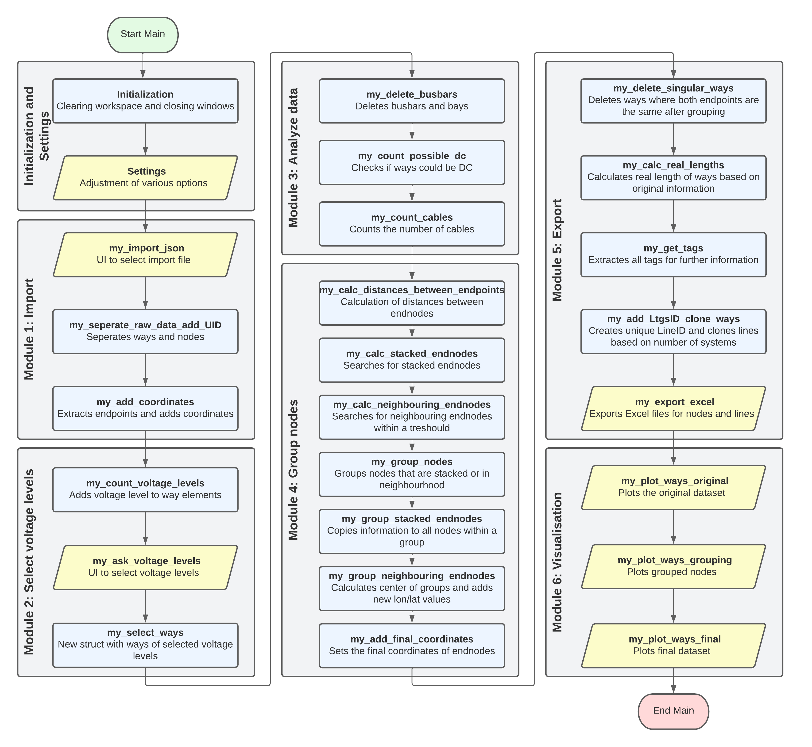
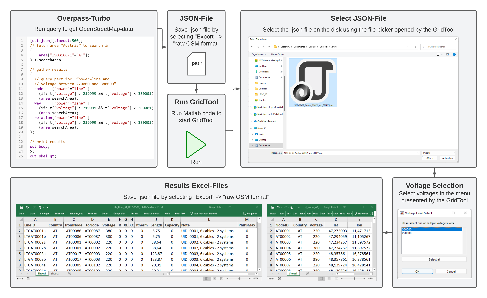

# GridTool

GridTool is an easy-to-use tool to convert and simplify electricity grid data from [OpenStreetMap](https://www.openstreetmap.org/) for the use in power simulation models (PSMs). Instead of relying on relations between lines and power stations (that are often missing) in the OpenStreetMap-data, the tool uses a heuristic approach to identify grid nodes and simplifies the data.

The GridTool shortens the lengthy process of converting and simplyfying electricity grid data from transmission and distribution system operators (TSOs and DSOs) for the use in PSMs to mere seconds.

The tool is programmed in MATLAB and the main advantages are its flexibility and easy customizability. The final results are two Excel files. One contains the nodes (power stations) and the second one contains the lines.

You can use this code freely according to the [LICENSE file](https://opensource.org/licenses/MIT), but please cite our paper [[1]](https://doi.org/10.1016/j.softx.2023.101314) if you do.

## Software Architecture
GridTool is split into 6 modules that itself are divided into 24 functions to ensure clarity, maintainability and easy expandability. The flowchart in Figure 1 shows the 6 modules and 24 functions. A detailed description of the functionality of these functions can be found in [[1]](https://doi.org/10.1016/j.softx.2023.101314) as well as in the comments of the MATLAB code itself.

  <picture>
    <source media="(prefers-color-scheme: dark)" srcset="Figures/GridTool_FlowChart_Detailed_DarkMode.png">
    
  </picture> 
  <b>Figure 1.</b> Flowchart showing the 6 modules and 24 funcitons of the GridTool.

## System Requirements
* **MATLAB**. The GridTool is coded in MATLAB. In order to use the GridTool, MATLAB with a valid MATLAB licence is required. GridTool is tested with MATLAB version R2021a, but is programmed in a way that it should be compatible with older and newer versions.
* **Microsoft Excel.** The results of the GridTool are stored in Microsoft Excel files (.xlsx).

## Manual

A comprehensive PDF-manual can be found in the docs folder or via [this link](https://github.com/IEE-TUGraz/GridTool/blob/main/docs/GridTool_User_Manual.pdf). Below is a summary of the most important things of the manual.

This provides a step-by-step instruction on how to run the GridTool. The steps are also visualized in the Figure 2.
1) Download the GridTool.m file on a PC that meets the system requirements.
2) Download the electricity grid data from OpenStreetMap using the [OverpassTurbo](https://overpass-turbo.eu/) website. An example of a query to download Austria's electricity grid lines between 220 kV and 380 kV can be found in the file *OverpassTurbo_Example_Query.txt*. Run the query in OverpassTurbo and export  the result as "Raw OSM data", which downloads the data in the json file format. For testing purposes you can also use the *2022-08-02_Austria_220kV_and_380kV.json* file provided in the repository.
3) Open the GridTool.m file in Matlab.
4) Adjust the settings in the *Initialization and Settings* section of the code.
5) Run the code by clicking the "Run"-button or pressing "F5".
4) A file window opens to select the previously downloaded json file.
5) After a few seconds, a new window pops up to select the desired voltage levels. Multiple voltage levels can be selected by holding the "Alt" key.
6) The GridTool is completed, when it displays "CONVERSION COMPLETED" in the MATLAB console. The final files can be found in the folder where the GridTool.m file is saved.

  <source media="(prefers-color-scheme: dark)" srcset="Figures/GridTool_Illustrative_Example_DarkMode.png">
    
  </picture> 
  <b>Figure 2.</b> Step-by-step guide for how to use the GridTool.

### Using Output of GridTool in Power System Models
1) Before using the data for power flow caculcations in PSMs, the results should be reviewed and rechecked with other sources (e.g. ENTSO-E Transmission System Map [[2]](https://www.entsoe.eu/data/map/)).
2) The column "Note" should be checked for the following comments, which indicate a problem with the line:
   1) **multiple vlevels**: Line has multiple voltage levels assigned to it. If it has more systems than votlage levels, the line might not have been multiplied correctl. See also warning in the MATLAB console.
   2) **potentially DC**: This indicates that the line could be a DC-line based on tag information. Recheck with other sources advised.
3) Add values for electric parameters (R, XL, XC, Itherm) to each line.
4) To allow power flow between different voltage levels, transformers need to be added between nodes at the same power station. These can easily be identified by the same lat- and lon-coordinates.
5) Integrate the data into your PSM.

### Warnings
The GridTool provides the user with warnings in the MATLAB console if it detects incosistent data or other errors. To help the user with handling the warnings, they are explained here with possible solutions.

* **ATTENTION! There is at least one way/node element which has a different amount of fields. It won't be imported!** : If the data exported from OSM has corrupted elements (hence, a field like "tags" is missing), this element will be ignored. A manual review of the *.json file is necessary.
* **ATTENTION! Way element UID XY does not contain a field "voltage". This way won't be selected**: Lines that do not have a field 'voltage' will be skipped. The lines with the printed UID should be checked manually by the user.
* **ATTENTION! UNKNOWN voltage level ("XYZ") in UID XY. This way won't be selected.**: This error can happen if the voltage level in the field "voltage" is either empty or text instead of a number. A manual review of that line with that UID in the *.json file is necessary.
* **ATTENTION! Two/Three voltage levels ("XYZ") in UID XY. This way will be duplicated/tripled**: The user is informed, that a line has two or three voltage levels and the line is doupled/tripled. No immediate user action needed, but the user can check with other sources if this is correct.
* **ATTENTION!  Way Element UID XY has type "busbar" or "bay", but is too long. Length: X km of max. Y km. This way won't be added to the "busbar" exception list**: The user is informed that a line has a value "busbar" or "bay" but its length is longer than the length set in busbar_max_length. Therefore, this busbar is handled like a line for the following steps.
* **ATTENTION! Unknown cable number ("X") in UID XY. This way won't be cloned automatically**: This can happen if a line has more than one voltage level and more than 2 systems. Based on the data the GridTool cannot know which voltage level has how many cables. This line is not cloned. A manual review of that line in the results is necessary. A check with other sources is recommended.
* **ATTENTION: Real line lenght WON'T be calculted! Beeline-length (Luftlinie) will be used**: The user is informed, that bool.calculate_real_line_length is set to false and therefore the beeline-length (shortest distance between start and end nodes) is used in the results.
* **ATTENTION!  More than 12 voltage levels are selected. Colors of voltage lines do repeat now! It is recommended to select max. 12 voltage levels**: For plotting the results, 12 colors for lines with different voltage levels that work good together have been defined. If there are more than 12 voltage levels the user is informed, that the colors repeat again. The user could define more colors in the MATLAB code.

### Deault behavior for missing tag data
The GridTool also uses tag information from OSM to find out the frquency of a line, voltage level, number of systems and so on. If some of the data is missing, the GridTool will fall back to defeault behaviors (but warnings will be shown in the MATLAB console).

* **No voltage level**: The line will be skipped and a warning message will be displayed to manually check the line.
* **No frequency**: It is assumed to be a 50 Hz AC-line.
* **No number of cables**: It is assumed to be just one system/line. A warning message will be displayed.
* **No name**: The GridTool does not rely on the name of an element. Therefore, an empty name tag will be ignored.

## Illustrative Example: Austrian Transmission Grid
In the figure below is a comparison between the official grid map from the Austrian transmission system operator APG (downloaded: August 3rd, 2022) and the result of the GridTool (data downloaded from OpenStreetMap: August 2nd, 2022). To run this illustrative example, you can use the *2022-08-02_Austria_220kV_and_380kV.json* file found in this repository with the GridTool. Figure 3 compares the official grid map from Austrias transmission system operator [APG](https://www.apg.at/stromnetz/stromnetz-oesterreich/) with the results of the GridTool.

  
  &nbsp;&nbsp;&nbsp;&nbsp;&nbsp;&nbsp;&nbsp;&nbsp;
   
  <b>Figure 3.</b> Official grid map from the Austrian transmission operator APG (l.s) and final results from the GridTool displayed on a map (r.s).

## Use Cases
The GridTool has been already used for research in different papers and projects. Some examples are listed below.

### Project START2030
The publicly funded project [START2030](https://start2030.wifo.ac.at/) aims at providing comprehensive analyses of the economic incidence and social impacts of a transition to a 100% renewable electricity system by 2030 as determined by Austria's Renewable-Energy-Act (EAG). For this the techno-economic simulation model ATLANTIS [[3]](https://doi.org/10.1007/s10100-015-0413-8) and the macroeconomic model DYNK [[4]](https://doi.org/10.1016/j.enpol.2018.11.030) are linked. For this project Austria's electricity grid in ATLANTIS was expanded to include the 110 kV network. As there is no public information about the distribution grid available from the Austrian DSOs, the GridTool was utilized to use the data from OpenStreetMap.

### Publication Modelling Africa's Power System
In order to build a digital twin of Africa's power system, the GridTool has been used to get electricity grid data. The data was then implemented into the Low-Carbon Expansion and Generaton (LEGO) model to perform techno-economic simulations. A research using this digital twin about transforming Africa's power system to 100% renewables can be found here [[5]](https://www.energy-proceedings.org/wp-content/uploads/2022/08/MITAB_2022_paper_2510.pdf).

## References
[1] R. Gaugl, S. Wogrin, U. Bachhiesl, L. Frauenlob, (2023). *"GridTool: An open-source tool to convert electricity grid data,"* SoftwareX, Volume 21, ISSN 2352-7110. [https://doi.org/10.1016/j.softx.2023.101314](https://doi.org/10.1016/j.softx.2023.101314)

[2] ENTSO-E, (2019). *"ENTSO-E Transmission System Map,"* (https://www.entsoe.eu/data/map/)

[3] H. Stigler, U. Bachhiesl, G. Nischler, G. Feichtinger, (2016). *"ATLANTIS: techno-economic model of the European electricity sector,"* Central European Journal of Operations Research, <i>24</i>(4), 965–988. [https://doi.org/10.1007/s10100-015-0413-8](https://doi.org/10.1007/s10100-015-0413-8)

[4] M. Kirchner, M. Sommer, K. Kratena, D. Kletzan-Slamanig, C. Kettner-Marx, (2019). *"CO2 taxes, equity and the double dividend – Macroeconomic model simulations for Austria,"* Energy Policy, Volume 126, Pages 295-314, ISSN 0301-4215. [https://doi.org/10.1016/j.enpol.2018.11.030](https://doi.org/10.1016/j.enpol.2018.11.030)

[5] R. Gaugl, S. Wogrin, and U. Bachhiesl (2022). *"Transition of the African Power System to Renewable Energies-A Case Study,"* Energy Proceedings MIT A+B Applied Energy Symposium, Volume 25, ISSN 2004-2965. [https://www.energy-proceedings.org/transition-of-the-african-power-system-to-renewable-energies-a-case-study/](https://www.energy-proceedings.org/transition-of-the-african-power-system-to-renewable-energies-a-case-study/)
